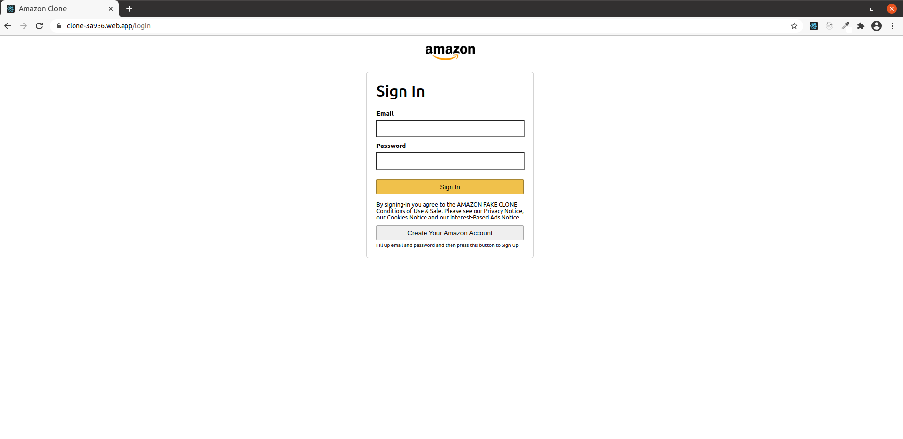
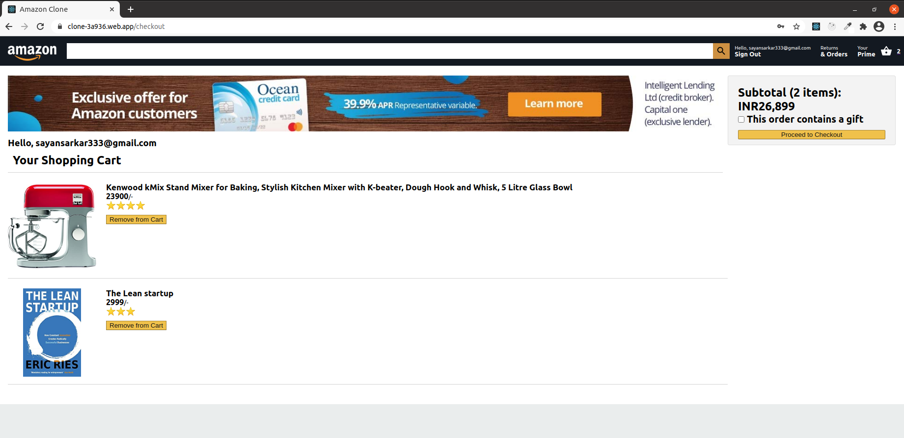
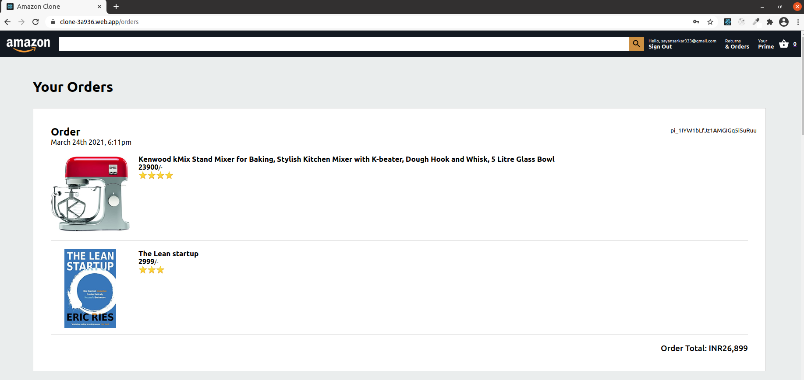

# Amazon Clone

## Home Page

## Front End
The front end has been made in ReactJS and is deployed [here](https://clone-3a936.web.app) using Firebase.

## Back End
The back end has been developed using ExpressJS and is deployed on Heroku. You can test a public backend endpoint [here](https://amazon-clone-react-sayan3sarka.herokuapp.com/)

## Login Page

## Cart Page

## Checkout/Payment Page
[Stripe]() has been implemented in both front-end and backend to have successful payments.
 

## Order Summary Page
